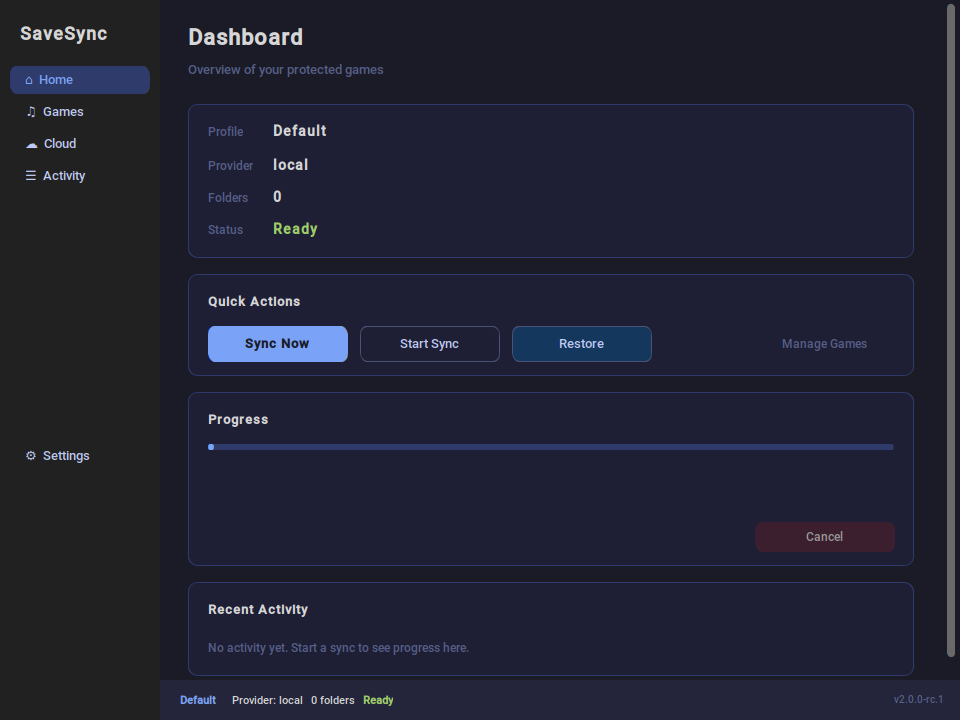
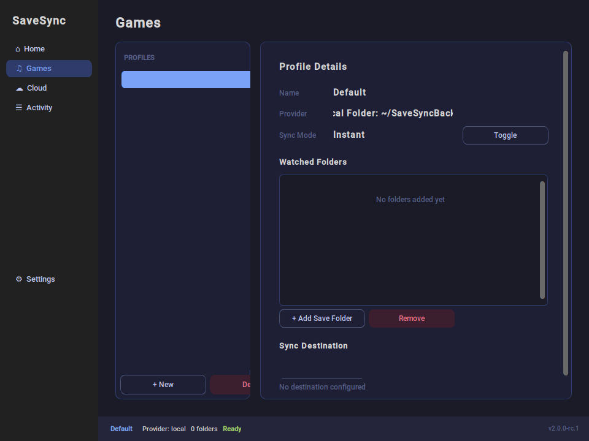
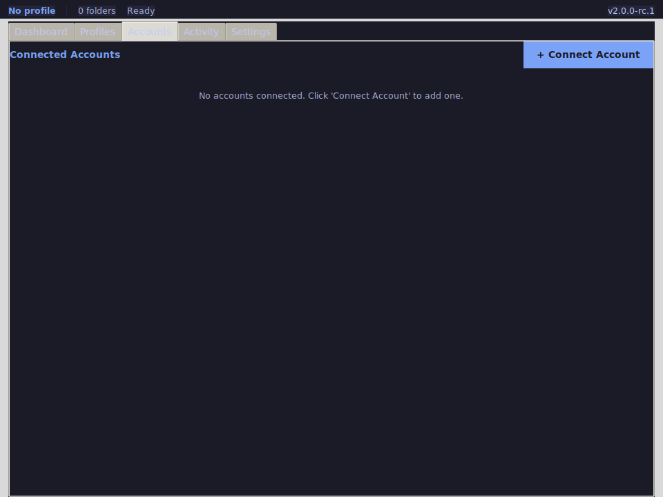
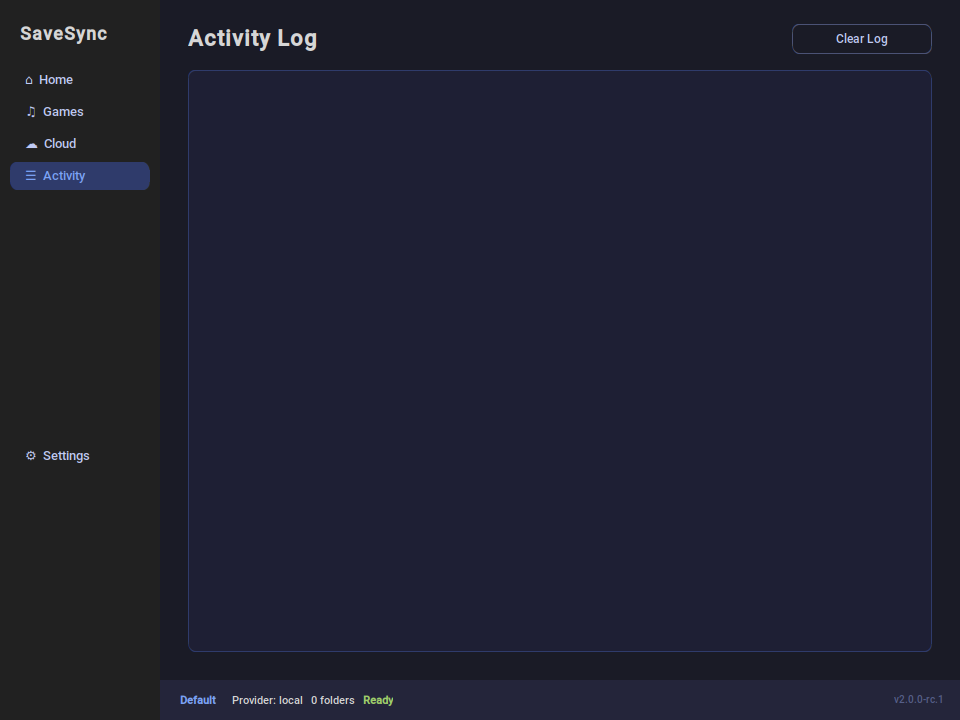
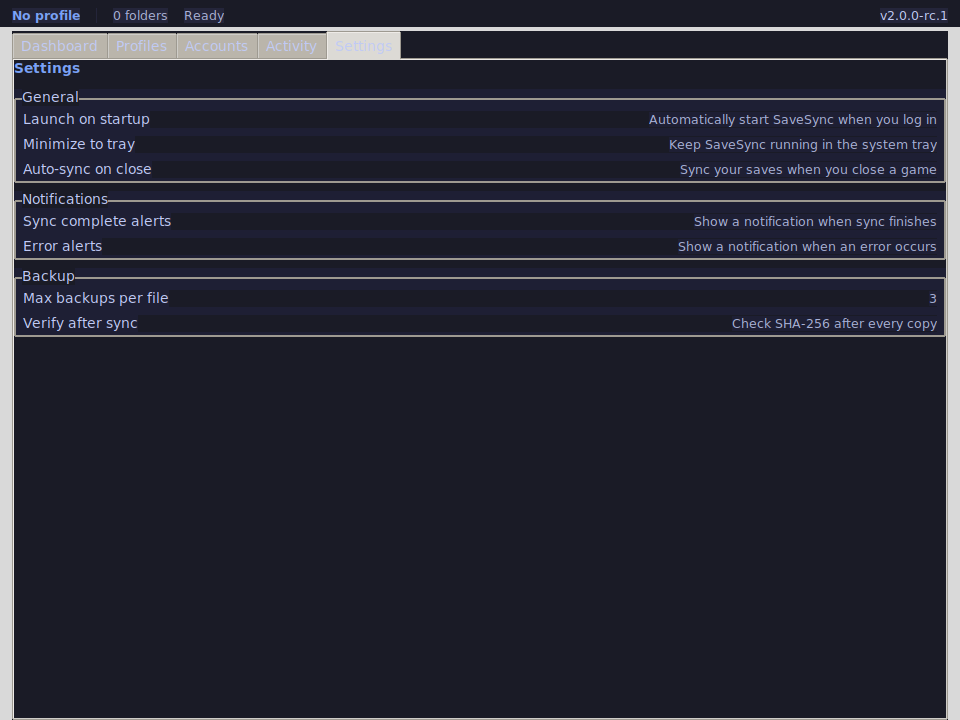

<picture>
  <source media="(prefers-color-scheme: dark)" srcset="assets/screenshots/dashboard.png">
  
</picture>

# SaveSync

**Never lose your game saves again.**

SaveSync automatically backs up, syncs, and restores your PC game saves so you can recover from crashes, reinstalls, or hardware failures with a single click.

[][release]

---

## Download

Get the latest version from the [releases page][release].

**Windows:** Download `SaveSync-v2.0.0-rc.2-windows-x64.exe` and run it.

**Linux:** Download `SaveSync-v2.0.0-rc.2-linux-x64` or the `.tar.gz` archive.

No installation required — single executable, no dependencies.

---

## Quick Start

1. **Launch SaveSync** — the main window opens with a Default profile
2. **Choose your save folder** — click Add Folder and select your game's save directory
3. **Choose a backup destination** — pick a local folder, external drive, or connect a cloud provider
4. **Click Sync Now** — your saves are copied and verified

Setup takes 30 seconds. After that, SaveSync watches for changes automatically.

---

## Supported Storage

| Storage | Type | Account Required |
|---|---|---|
| Local folder | Local | No |
| External drive / USB | Local | No |
| Google Drive | Cloud | Yes |
| Dropbox | Cloud | Yes |
| OneDrive | Cloud | Yes |

---

## Screenshots

| Dashboard | Profiles | Accounts |
|:---:|:---:|:---:|
|  |  |  |

| Activity | Settings |
|:---:|:---:|
|  |  |

---

## Features

- Automatic file monitoring — no manual scanning needed
- One-click restore with SHA-256 verification
- Multiple backup profiles for different games
- Background sync with live progress tracking
- Local, external drive, Google Drive, Dropbox, and OneDrive support
- Activity log with filtering

---

## Why You Can Trust SaveSync

- **SHA-256 verification** on every backup and restore
- **Open source** — review the code, build it yourself
- **Local-first** — works fully offline; cloud is optional
- **193 automated tests** covering backup, restore, sync, and reliability

---

## System Requirements

- **Windows:** 7, 8, 10, 11 (64-bit)
- **Linux:** x64 (development builds available)
- **No dependencies** — single executable, nothing to install

---

## Known Limitations

- Unsigned Windows executable may trigger SmartScreen (click "Run anyway")
- Cloud storage requires your own OAuth app credentials (setup guide included)
- Automatic updates not yet implemented

---

## For Developers

- [Architecture](docs/dev/ARCHITECTURE.md)
- [Design Principles](docs/dev/DESIGN_PRINCIPLES.md)
- [Contributing](docs/CONTRIBUTING.md)
- [Decisions](docs/dev/DECISIONS.md)
- [Security Policy](docs/SECURITY.md)

---

## License

Proprietary. All rights reserved.

[release]: https://github.com/MohamedHussien-zseeker/SaveSync/releases/tag/v2.0.0-rc.2
